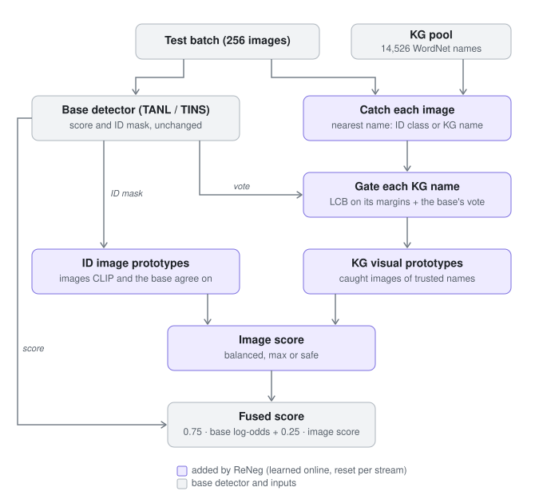

# ReNeg: Knowledge-Graph Negative Labels Grounded in the Test Stream

[](https://github.com/NabilRafi/ReNeg/actions/workflows/tests.yml)
[](LICENSE)


Code, configurations, notebooks and results for **ReNeg**, a training-free plug-in for test-time
out-of-distribution (OOD) detection with CLIP.

Negative-label detectors (NegLabel, AdaNeg, TANL) flag an image as OOD when it looks more like a word far from the
in-distribution (ID) classes than like an ID class. Near-OOD images are close relatives of the ID classes, whose
names those word lists largely miss. ReNeg adds **14,526 near-OOD names from WordNet** around the 1,000 ImageNet
classes, trusts a name only after a **confidence gate** (a lower confidence bound on its text margins, plus the base
detector's own vote), and **grounds each trusted name in the test stream**: the images it catches become its visual
prototype. Images that CLIP and the base detector both trust as ID form online **ID image prototypes**. The image
score that compares an image with both sets of prototypes is fused with the base score. ReNeg never changes the base
detector, needs no training and no labels, and is reset with every test stream.

<p align="center"></p>

## Results

CLIP ViT-B/16, ImageNet-1K as ID. FPR95 (%, lower is better; OpenOOD's convention, OOD positive) and AUROC (%),
mean over three stream orders. Every number below comes from a file in [`results/`](results/).

**Zero-shot: ReNeg on TANL** ([`results/g3_vitb16/`](results/g3_vitb16/), `configs/main_vitb16.yaml`)

| Method | OpenOOD v1.5 near | OpenOOD v1.5 far | Four-OOD |
| --- | --- | --- | --- |
| TANL (our reproduction; paper: 60.06 / 17.21 / 9.81) | 60.05 / 84.53 | 16.98 / 96.23 | 9.89 / 97.82 |
| **ReNeg-balanced** (blind pool) | **56.57** / 87.12 | **14.66** / 97.19 | **9.61** / 98.10 |
| ReNeg-max (blind pool) | 52.76 / 87.26 | 12.73 / 97.41 | 10.56 / 97.90 |
| ReNeg-safe (blind pool) | 58.50 / 86.37 | 16.43 / 96.69 | 9.96 / 97.99 |

ReNeg-balanced is better than TANL on all three benchmarks in each of the three stream orders (paired differences
-3.49 [-4.36, -2.83], -2.31 [-2.47, -2.11], -0.28 [-0.51, -0.11]). The *blind* pool excludes the class names of the
near-OOD benchmarks; with them (*full* pool) balanced gives 56.39 / 14.72 / 9.68. On ViT-L/14
([`results/g3b_vitl14/`](results/g3b_vitl14/)) balanced improves our TANL by -3.20 / -2.81 / -1.29.

**Few-shot (5 labelled ImageNet images per class): ReNeg on TINS and on TANL + TINS** (FPR95 in TINS's convention,
ID positive; Four-OOD on the 45k non-labelled ID images; replays on TINS scores from
[`results/p4_tins/`](results/p4_tins/), the official run [G4](results/g4_d1/) is pending)

| Method | near | far | Four-OOD |
| --- | --- | --- | --- |
| TANL (no labels) | 53.72 | 17.06 | 9.40 |
| ReNeg-balanced on TANL | 40.98 | 11.43 | 7.29 |
| TINS (our re-implementation; paper with 16 shots: 57.88 / 12.99 / 6.72) | 56.63 | 11.79 | 6.83 |
| ReNeg-balanced on TINS | 48.31 | 9.95 | 6.20 |
| TANL + TINS (mean log-odds) | 50.75 | 11.57 | 5.70 |
| **ReNeg-balanced on TANL + TINS** | **39.32** | **9.60** | **5.55** |

Why two FPR95 conventions appear: [docs/FPR95_CONVENTIONS.md](docs/FPR95_CONVENTIONS.md).

## Repository structure

```
ReNeg/
├── src/
│   ├── reneg/                  ReNeg: KG gate, online ID model, image score (core.py), ReNeg on TANL
│   │                           (reneg_tanl.py), heads on any base (multi.py), TINS re-implementation (tins.py),
│   │                           CLI pipeline (pipeline.py), Seam 1 probes (g1*.py, gen.py, prior.py), the KG pool
│   └── oodlab/                 benchmark library: CLIP feature cache, OpenOOD v1.5 / Four-OOD protocols, metrics,
│                               TANL, AdaNeg, NegLabel, MCM re-implementations (equal to the official code)
├── configs/                    one YAML per paper table: main, ViT-L/14, few-shot (TINS), baselines, ablations
├── scripts/                    build_cache.py -> evaluate.py -> summarize.py; export_features.py (for experiments/)
├── experiments/                CPU replays: ablations, diagnostics, supplementary and negative results (00-11)
├── notebooks/                  the notebooks that produced the results (Kaggle 00-04, Colab C0-G4)
├── results/                    every result file behind the paper, with run logs and notes
├── docs/                       method, reproduction, data, experiment log, negative results, guides
├── tests/                      unit tests (oodlab, reneg)
├── tools/                      notebook builders, Colab/Kaggle packaging, smoke tests
├── licenses/                   third-party licences (CLIP, OpenOOD-VLM, NegLabel word lists, WordNet)
└── assets/                     figures
```

## Installation

```bash
git clone https://github.com/NabilRafi/ReNeg.git
cd ReNeg
pip install -e ".[all]"          # Python 3.9+; or: pip install -r requirements.txt
```

PyTorch with CUDA is needed only for encoding images and for TINS; everything else runs on a CPU. CLIP's code is
vendored (`src/oodlab/_vendor/clip`); its weights are downloaded on first use.

## Quick start

```bash
pytest -q                                   # unit tests (official TANL / AdaNeg / NegLabel == ours, ReNeg, TINS)
bash tools/smoke_pipeline.sh                # the whole pipeline on a tiny fake dataset (CPU, ~3 min)
python scripts/summarize.py results/g3_vitb16/g3_runs.csv --ref tanl      # the main table from the shipped rows
```

## Reproducing the paper

```bash
# 1. Encode every benchmark image once with CLIP (GPU, ~1-2 h for ViT-B/16)
python scripts/build_cache.py --home oodlab_work --inputs /data/imagenet /data/openood

# 2. Evaluate a configuration (resumable; one row per method, protocol, OOD set and stream order)
python scripts/evaluate.py --config configs/main_vitb16.yaml --cache oodlab_work/working/cache --out runs/main

# 3. Tables: group means, both FPR95 conventions, paired differences against TANL
python scripts/summarize.py runs/main/runs.csv --ref tanl
```

| Paper | Configuration | GPU time (RTX 4060) | Shipped result |
| --- | --- | --- | --- |
| Main table (ViT-B/16) + few-shot rows on TANL | `configs/main_vitb16.yaml` | 1.6 h | `results/g3_vitb16/` |
| Second backbone (ViT-L/14) | `configs/vitl14.yaml` | 45 min | `results/g3b_vitl14/` |
| Few-shot table (TINS, ReNeg on TINS, on TANL + TINS) | `configs/fewshot_tins.yaml` | 2-3 h | `results/p4_tins/` (G4 pending) |
| Baselines (MCM, NegLabel, TANL) | `configs/baselines_vitb16.yaml` | 1 h | `results/baselines/` |
| ViT-L/14 set-up check | `configs/baselines_vitl14.yaml` | 10 min | pending |
| Ablations on TANL | `configs/ablation_tanl_base.yaml` | 2 h | `results/replays/` |
| Ablation ladder on NegLabel's negatives | `configs/ablation_neglabel_base.yaml` | 30 min | `results/replays/` |

[docs/REPRODUCE.md](docs/REPRODUCE.md) has the expected numbers, run times and the three levels of checking (smoke
test, tables from the shipped results, full re-run). [docs/DATA.md](docs/DATA.md) says where every dataset comes
from.

## Ablations and supplementary experiments

TANL's dynamics do not depend on ReNeg, so TANL runs once per stream and ReNeg's variants are replayed on its
trace on a CPU ([`experiments/`](experiments/); the replay equals the packaged method to 3e-5).

| Experiment | Question |
| --- | --- |
| `02_replay.py` | any operating point or ablation on three stream orders, both conventions |
| `03_four_ood_diagnosis.py`, `04_four_ood_fixes.py` | why the first release lost on Four-OOD, and the admission rule that fixed it |
| `05_fewshot_and_oracle.py` | labelled ID images; oracle ID models (purity of the ID prototypes is the main lever) |
| `06_pseudo_ood_tuning.py` | settings chosen on held-out ImageNet classes, without benchmark OOD data |
| `07_reneg_on_tins.py` | ReNeg on TINS and on TANL + TINS, with the pre-registered pass rule |
| `08`-`11` | Seam 1: translating names into image space (generated images, a diffusion prior, six bridges, the ceiling of a perfect bridge) |

Every step was run with a pass rule fixed before the run; the [experiment log](docs/EXPERIMENT_LOG.md) lists them
in order and [docs/NEGATIVE_RESULTS.md](docs/NEGATIVE_RESULTS.md) collects what did not work.

## Documentation

| Document | Contents |
| --- | --- |
| [docs/METHOD.md](docs/METHOD.md) | the method, its operating points and defaults, ReNeg on other bases, the protocol |
| [docs/REPRODUCE.md](docs/REPRODUCE.md) | commands, expected numbers and run times for every table |
| [docs/DATA.md](docs/DATA.md) | benchmarks, the feature cache, the 8-bit exports, licences |
| [docs/EXPERIMENT_LOG.md](docs/EXPERIMENT_LOG.md) | every step with its pass rule, result and decision |
| [docs/NEGATIVE_RESULTS.md](docs/NEGATIVE_RESULTS.md) | Seam 1, dropped design choices, open problems |
| [docs/FPR95_CONVENTIONS.md](docs/FPR95_CONVENTIONS.md) | OOD-positive vs ID-positive FPR95 |
| [docs/KAGGLE_GUIDE.md](docs/KAGGLE_GUIDE.md), [docs/COLAB_GUIDE.md](docs/COLAB_GUIDE.md) | running the notebooks |

## Citation

If you use this code, please cite it (see [`CITATION.cff`](CITATION.cff)):

```bibtex
@software{ferdous2026reneg,
  author  = {Ferdous, Mohammad Nabil},
  title   = {{ReNeg}: Knowledge-Graph Negative Labels Grounded in the Test Stream for Test-Time {OOD} Detection with {CLIP}},
  year    = {2026},
  url     = {https://github.com/NabilRafi/ReNeg},
  version = {0.3.0}
}
```

## License and acknowledgements

MIT ([LICENSE](LICENSE)). Third-party code and data keep their own licences ([THIRD_PARTY_NOTICES.md](THIRD_PARTY_NOTICES.md)):
OpenAI's CLIP, OpenOOD-VLM's official TANL / AdaNeg / NegLabel postprocessors (vendored for equivalence tests),
NegLabel's WordNet word lists and WordNet 3.0. We thank the authors of TANL, AdaNeg, NegLabel, MCM, TINS and
OpenOOD for releasing their code and benchmarks.
